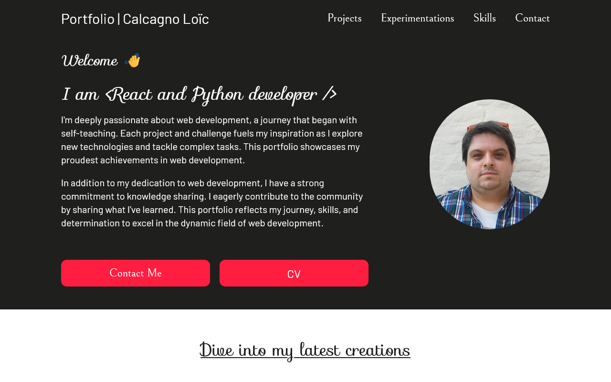

<h1 align="center">Portfolio</h1>

  

I am React and Python developer.

I'm deeply passionate about web development, a journey that began with self-teaching. Each project and challenge fuels my inspiration as I explore new technologies and tackle complex tasks. This portfolio showcases my proudest achievements in web development.

In addition to my dedication to web development, I have a strong commitment to knowledge sharing. I eagerly contribute to the community by sharing what I've learned. This portfolio reflects my journey, skills, and determination to excel in the dynamic field of web development.

## Built with

- Semantic HTML5 markup
- Mobile-first workflow
- TailwindCSS
- React
- TypeScript
- EmailJS

## Networks

- Personnal website - [Portfolio](https://calcagno-loic.netlify.app/)
- Frontend Mentor - [@CalcagnoLoic](https://www.frontendmentor.io/profile/CalcagnoLoic)
- Linkedin - [LinkedIn](https://www.linkedin.com/in/loic-calcagno/)
- CodeWars - [CalcagnoLoic](https://www.codewars.com/users/CalcagnoLoic)
