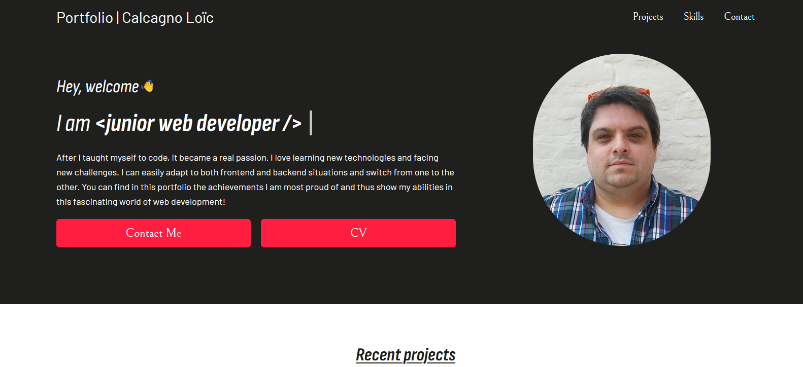

<h1 align="center">Portfolio</h1>

    
    
    

Ce projet constitue mon portfolio avec les différents projets que je mets en avant. En particulier des challenges provenant de sites externes ou des challenges fullstack personnel.

